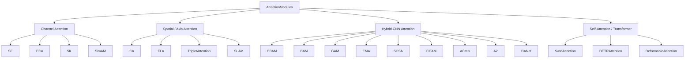
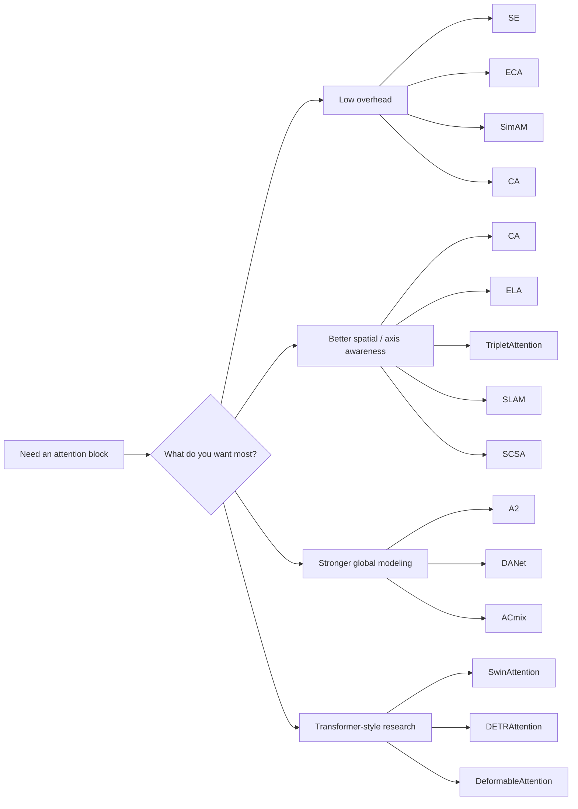
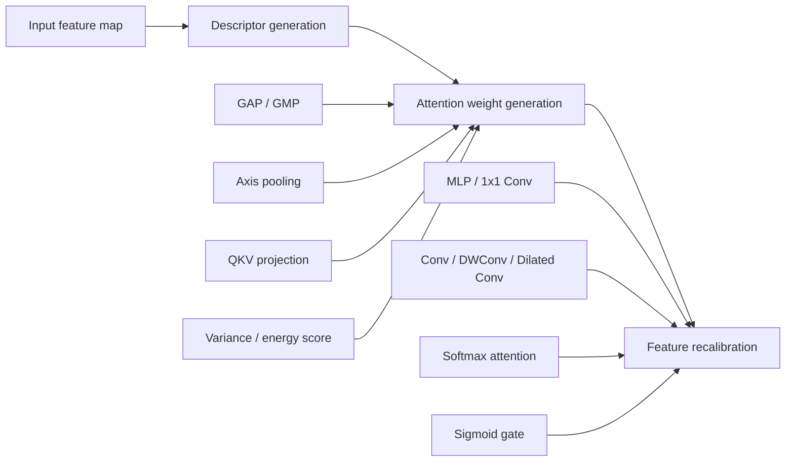

# AttentionModules

> A compact PyTorch toolbox of visual attention modules for CNNs, hybrid models, and Transformer-style architectures.

<p align="center">
  
  
  
</p>

This repository collects a range of attention mechanisms commonly used in computer vision, from lightweight channel attention blocks to global self-attention and deformable attention. It is designed for two main goals:

- `Plug-and-play experimentation` in your own models
- `Code reading and learning` for understanding how different attention modules are implemented in PyTorch

## ✨ Highlights

- Clean PyTorch implementations with readable structure
- Most modules use the standard `(B, C, H, W)` input/output convention
- Includes lightweight, axis-aware, hybrid, and Transformer-style attention blocks
- A good reference repo for comparing implementation ideas across attention families

## 🗂 Repository Structure

```text
AttentionModules/
├── AttentionModules/
│   ├── A2.py
│   ├── ACmix.py
│   ├── BAM.py
│   ├── CA.py
│   ├── CBAM.py
│   ├── CCAM.py
│   ├── DANet.py
│   ├── DETRAttention.py
│   ├── DeformableAttention.py
│   ├── ECA.py
│   ├── ELA.py
│   ├── EMA.py
│   ├── GAM.py
│   ├── SCSA.py
│   ├── SE.py
│   ├── SimAM.py
│   ├── SK.py
│   ├── SLAM.py
│   ├── SwinAttention.py
│   └── TripletAttention.py
└── README.md
```

## 🚀 Quick Start

### Install

Requirements:

- Python `3.8+`
- PyTorch `2.x`

If PyTorch is already installed, this repo is ready to use directly.

### Import a module

```python
from AttentionModules import SE, CA, CBAM, ECA

attn = SE(channels=64, reduction=4)
out = attn(x)  # x: (B, C, H, W)
```

### Insert into a convolution block

```python
import torch.nn as nn
from AttentionModules import CBAM


class ConvBlock(nn.Module):
    def __init__(self, c1, c2):
        super().__init__()
        self.block = nn.Sequential(
            nn.Conv2d(c1, c2, 3, padding=1, bias=False),
            nn.BatchNorm2d(c2),
            nn.ReLU(inplace=True),
            CBAM(c2),
        )

    def forward(self, x):
        return self.block(x)
```

### Transformer-style example

```python
from AttentionModules import DETRAttention

attn = DETRAttention(d_model=256, num_heads=8)
out = attn(query)  # query: (B, N, 256)
```

## 🧠 Module Landscape

### Attention family map



### Comparison table

| Module | Family | Main idea | Typical implementation pattern |
|---|---|---|---|
| `SE` | Channel | Learn per-channel importance from global context | `GAP + bottleneck + sigmoid` |
| `ECA` | Channel | Lightweight local channel interaction without dimensionality reduction | `GAP + Conv1d` |
| `SK` | Channel / Multi-scale | Adaptive receptive field selection across branches | `multi-branch conv + softmax` |
| `SimAM` | Parameter-free | Element-wise saliency from statistics | `variance-based energy score` |
| `CA` | Coordinate / Axis | Encode positional information through H/W decomposition | `axis pooling + split projection` |
| `ELA` | Axis | Independent height and width attention generation | `mean pooling + directional conv` |
| `TripletAttention` | Axis / Cross-dimension | Reuse one gate under different tensor permutations | `permute + shared gate` |
| `SLAM` | Spatial / Axis hybrid | Jointly model height, width, and spatial saliency | `three-branch gating` |
| `CBAM` | Hybrid CNN | Sequential channel then spatial refinement | `channel gate -> spatial gate` |
| `BAM` | Hybrid CNN | Parallel channel and spatial bottleneck attention | `dilated conv + residual gate` |
| `GAM` | Hybrid CNN | Stronger channel interaction before spatial modeling | `MLP-like channel + conv spatial` |
| `EMA` | Hybrid CNN | Grouped axis-aware gating with spatial response mixing | `group split + axis gate + spatial mix` |
| `SCSA` | Hybrid CNN | Multi-scale spatial-axis attention plus pooled channel self-attention | `MS Conv1d + pooled self-attn` |
| `CCAM` | Hybrid CNN | Channel attention followed by coordinate attention | `channel gate + coordinate gate` |
| `A2` | Global attention | Gather global descriptors, then redistribute them | `gather-distribute` |
| `DANet` | Global attention | Parallel position attention and channel attention | `PAM + CAM` |
| `ACmix` | Conv-attention fusion | Fuse local self-attention and dynamic convolution | `shared qkv + fusion weights` |
| `SwinAttention` | Transformer | Window-based attention with optional shift | `window partition + relative bias` |
| `DETRAttention` | Transformer | Standard multi-head attention for self/cross attention | `qkv linear + scaled dot-product` |
| `DeformableAttention` | Transformer | Sparse learned sampling instead of dense attention | `offset + sparse sampling` |

## 📊 At-a-Glance Selection Guide



## 🔍 Implementation Notes by Module

This section focuses on how each module is implemented in this repo rather than only what the original paper proposes.

### 1. `SE`

- Applies global average pooling to compress `(B, C, H, W)` into `(B, C, 1, 1)`
- Uses a bottleneck MLP implemented with two `1x1` convolutions
- Produces channel weights with `sigmoid` and rescales the input channel-wise

Best for: a simple, stable, classic channel attention baseline.

### 2. `ECA`

- Starts from global average pooled channel descriptors
- Avoids explicit dimensionality reduction
- Uses `Conv1d` over the channel descriptor sequence for local channel interaction

Best for: lightweight models and low-overhead attention insertion.

### 3. `SK`

- Builds several convolution branches with different kernel sizes
- Sums branch outputs to form a fused global descriptor
- Uses a shared compression layer and branch-specific projections
- Applies `softmax` across branches to adaptively choose receptive field scale

Best for: multi-scale feature selection.

### 4. `SimAM`

- Adds no extra convolution or MLP parameters
- Computes element importance from mean, variance, and deviation statistics
- Generates an element-wise attention map directly from a closed-form score

Best for: parameter-free attention experiments.

### 5. `CA`

- Pools separately along width and height
- Concatenates directional descriptors before a shared projection
- Splits them back into H-branch and W-branch attention maps
- Reweights features using both directional gates

Best for: preserving positional cues with low cost.

### 6. `ELA`

- Decomposes spatial modeling into two axis-specific branches
- Uses directional pooling and dedicated convolutional transforms
- Produces independent height-aware and width-aware attention maps

Best for: axis-aware local enhancement.

### 7. `TripletAttention`

- Defines a reusable `AttentionGate`
- Inside the gate, `ZPool` concatenates channel-wise average and max maps
- Uses the same gating unit under different tensor permutations
- Aggregates information from `HW`, `HC`, and `WC` interaction views

Best for: cross-dimension interaction with small overhead.

### 8. `SLAM`

- Builds three branches: height-aware, width-aware, and spatial
- Each branch generates its own gate
- Multiplies all gates back into the input feature map

Best for: intuitive multi-view spatial refinement.

### 9. `CBAM`

- First computes channel attention using both average pooling and max pooling
- Then computes spatial attention from channel-compressed feature maps
- Applies the two stages sequentially

Best for: a strong and widely used CNN attention baseline.

### 10. `BAM`

- Uses a channel bottleneck branch and a spatial branch in parallel
- Spatial modeling relies on dilated convolutions to enlarge receptive field
- Final output is residual-style: `x * (1 + M)`

Best for: stable parallel channel-spatial refinement.

### 11. `GAM`

- Performs a stronger channel interaction stage before spatial refinement
- Treats channel attention less like pure pooling and more like learned mapping
- Follows with convolutional spatial reweighting

Best for: global channel interaction plus spatial enhancement.

### 12. `EMA`

- Splits channels into groups to reduce cost
- Applies axis-aware gating per group
- Combines grouped directional information with spatial response mixing

Best for: efficient multi-axis fusion.

### 13. `SCSA`

- Spatial part uses multi-scale depthwise `Conv1d` branches over H/W directions
- Channel part uses pooled self-attention on a reduced spatial grid
- Combines directional spatial gating with pooled channel interaction

Best for: stronger expressive power than classic lightweight modules.

### 14. `CCAM`

- Applies channel attention first
- Then performs coordinate-style H/W attention on the refined features
- Works like a chained combination of CAM and coordinate attention

Best for: channel-first coordinate enhancement.

### 15. `A2`

- Uses three `1x1` projections
- First attention stage gathers global descriptors
- Second stage redistributes those descriptors back to spatial locations

Best for: global context aggregation with a clear gather-distribute design.

### 16. `DANet`

- Includes two parallel branches:
- `PAM` for spatial position attention
- `CAM` for channel attention
- Fuses both outputs after residual-style weighting

Best for: stronger global dependency modeling in dense prediction tasks.

### 17. `ACmix`

- Shares `q`, `k`, `v` projections for both branches
- One branch performs local self-attention with unfolded neighborhoods
- The other branch behaves like dynamic convolution
- Learns how much to trust each branch through trainable fusion weights

Best for: blending the strengths of convolution and attention.

### 18. `SwinAttention`

- Converts input from `(B, C, H, W)` to `(B, H, W, C)` internally
- Splits features into local windows
- Runs multi-head self-attention inside each window
- Supports shifted windows and relative position bias

Best for: learning the core idea behind Swin Transformer attention.

### 19. `DETRAttention`

- Standard multi-head attention implementation
- Supports both self-attention and cross-attention
- Uses linear `Q/K/V` projections, scaled dot-product attention, output projection, and normalization

Best for: understanding the core attention block used in DETR-style models.

### 20. `DeformableAttention`

- Flattens feature maps into token sequences
- Predicts sparse sampling offsets and attention weights for each query
- Samples features with `grid_sample`
- Aggregates only a small number of learned positions instead of attending densely everywhere

Best for: efficient sparse attention over images.

## 🧩 A Shared Mental Model

Even though the module names are different, many of them follow a similar pipeline:



This is a useful way to read the code: first ask how the descriptor is built, then how the attention map is generated, and finally how the original features are reweighted.

## 🧪 Input / Output Conventions

Most modules follow:

```python
x.shape == (B, C, H, W)
out.shape == (B, C, H, W)
```

Exceptions:

- `DETRAttention` expects `(B, N, d_model)`
- `SwinAttention` takes `(B, C, H, W)` externally but internally converts to `(B, H, W, C)`

## 🎯 Which Module Should I Start With?

### If you want lightweight and easy-to-plug modules

- `SE`
- `ECA`
- `CA`
- `CBAM`
- `SimAM`

### If you want stronger spatial or axis modeling

- `CA`
- `ELA`
- `TripletAttention`
- `SLAM`
- `SCSA`

### If you want stronger global dependency modeling

- `A2`
- `DANet`
- `DETRAttention`
- `SwinAttention`
- `DeformableAttention`

### If you want convolution-attention hybrids

- `ACmix`
- `GAM`
- `EMA`
- `BAM`

## 📌 Suggested Next Improvements

This repository already works well as an implementation collection, but it could become an even stronger reference if you add:

- Paper links and publication years for every module
- Parameter count and FLOPs comparison
- Recommended insertion positions in backbone / neck / head
- Standalone structure diagrams for each module
- Minimal runnable demos and benchmark snippets

## 🤝 Final Note

This repo is already a strong learning-oriented collection for attention modules. With a few more benchmark tables and paper references, it can easily grow from a code toolbox into a polished attention handbook for vision research and engineering.
